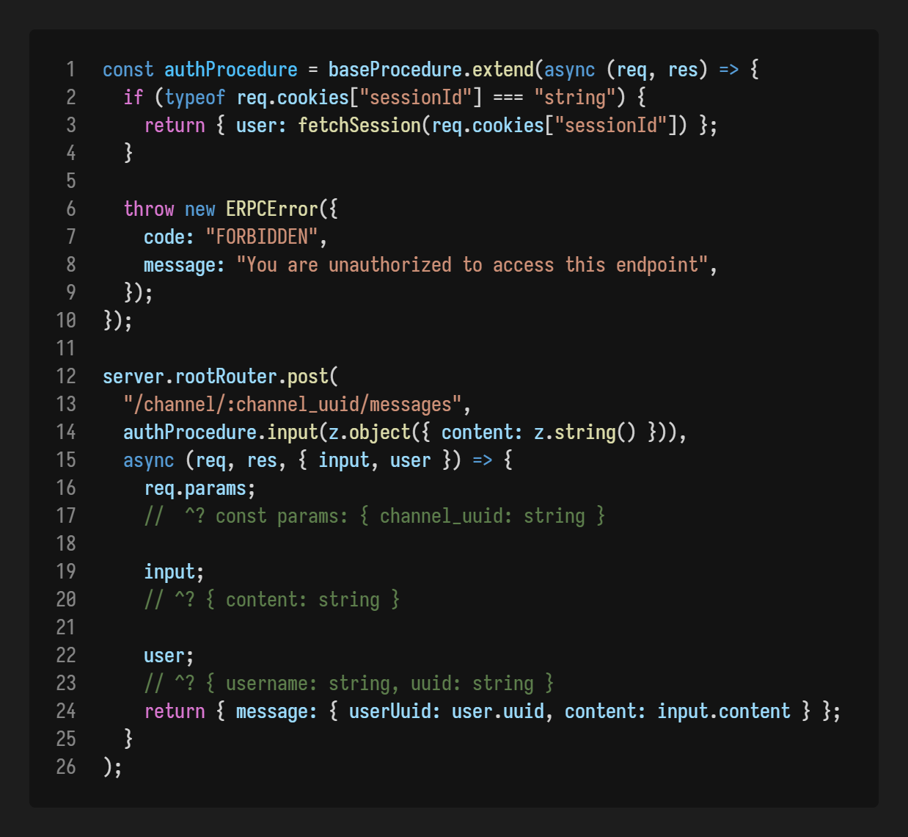

## @scinorandex/erpc 

A library for building type-safe Express and WebSocket APIs.




## Features

 - Full typesafety and autocompletion - HTTP endpoints know the context of their middleware and request path
 - Seamless WebSocket support - write WebSocket endpoints like any other HTTP method
 - Seamless File upload support - Automatic `multipart/form-data` detection, validate file uploads with the same validation syntax.
 - Fast - No build step, all endpoints are attached directly to Express routers on start up for a minimal runtime footprint
 - Increased quality of life:
   - `express.json()`, `cookie-parser`, `morgan`, enabled by default, `cors` optionally available
   - Automatic error and promise reject handling 


## Getting Started

Install the package with your preferred package manager:

```bash
yarn add @scinorandex/erpc # or npm install @scinorandex/erpc
```

Import the necessary packages and initialize your server:

```ts
import { z } from "zod";
import { baseProcedure, Server } from "@scinorandex/erpc";

const server = new Server({
  port: 2000,
  defaultMiddleware: {
    bodyParser: true,
    cookieParser: true,
    corsOptions: { credentials: true, origin: "http://localhost:2000" },
  },
});
```

Implement your first endpoint:

```ts
server.rootRouter.post(
  "/login",
  baseProcedure.input(z.object({ username: z.string(), password: z.string() })),
  async (req, res, { input }) => {
    console.log("User wants to login: ", input)
    return { success: true };
  }
);
```

Once you're done, run the file and send a POST request to `http://localhost:2000/login`


## Usage

### Defining procedures

A procedure serves as a middleware chain through which a request passes through. It employs the immutable builder pattern, allowing for the reuse of a single procedure to provide common functionality across various child procedures. The default procedure is exported under `baseProcedure`.

To extend procedures, you can utilize the `.extend()` method by passing a callback. This callback receives an **untyped** `Express.Request` object and a `Express.Response` object, whose `locals` property **(known from here as the context object)** is typed as a merger of the output types of the preceding middleware. The output of the function is merged with the existing context object.

To create a procedure that only allows for authenticated users:
```ts
const authProcedure = baseProcedure.extend(async (req, res) => {
  if (typeof req.cookies["sessionId"] === "string") {
    const user: User = fetchSession(req.cookies["sessionId"])
    return { user };
  }

  throw new ERPCError({ code: "FORBIDDEN", message: "Unauthenticated" });
});
```

We can extend `authProcedure` further to only allow administrators by chaining another middleware to it:

```ts
const adminsOnly = authProcedure.extend(async (req, res) => {
  // Access the user object from the context object
  // user is typed as User since type information is preserved between middleware
  const { user } = res.locals;

  if (user.accountType === "admin") return { isAdmin: true };
  throw new ERPCError({ code: "UNAUTHORIZED", message: "Insufficient permissions" });
});
```

---

### Request body validation

To validate the request body, call and pass a Zod validator into the `.input()` method of the procedure. This adds an `input` property to the context object whose typed as the parsing type specified by the validator. 

To validate file uploads, you can use the `zodFile()` helper by passing either a single acceptable mimetype or an array of acceptable mimetypes.

**A note when validating `multipart/form-data` request bodies:**

`multipart/form-data` can only serialize non-binary data as plain text, meaning `6` and `"6"` are interpreted as the same value. When validating a non-string field, you must apply a pre-processor to convert from the stringified type to the actual type.

```ts
authProcedure.input(z.object({
    image: zodFile(["image/png", "image/jpg", "image/jpeg"]),
    number_property: z.preprocess((a) => parseInt(a as string, 10), z.number())
}))
```

---

### Query validation

To validate the request query's parameters, call and pass a Zod validator into the `.query()` method of the procedure. This adds a `query` proeprty to the context object whose typed as the parsing type specified by the validator.

**A note about nested validators and non-string properties:**

You can choose to encode query parameters as `JSON.stringify`ed `base64url` under the `__erpc_query` key to allow for nesting and non-string properties.

To use in a client:
```ts
const query = { foo: "bar", baz: true, qux: 6 }
const queryString = Buffer.from(JSON.stringify(query)).toString("base64url");
fetch(`/<endpoint>?__erpc_query=${queryString}`);
```

---

### Routers

Routers are used to organize endpoints. A router can be forked by calling its `sub()` method and passing the path of the subrouter, creating a child router that has the path context of its ancestors. The root level router of a server can be accessed under `server.rootRouter` property.

In this example, endpoints defined under userRouter will have `user_uuid` accessible in `req.params`:
```ts
const server = new Server({ port: 2000 });
const userRouter = server.rootRouter.sub("/user/:user_uuid");
```

### HTTP Endpoints

You can attach HTTP endpoints to a router using its `get`, `post`, `patch`, `put` and `delete` methods. These methods requires three parameters, the first is the endpoint's path, the second is the `Procedure`, and the third is the handler function.

The handler function accepts three parameters: the request object, the response object, and the context object(an alias to `response.locals`). `request.params` is typed based on the path parameters in the endpoint's combined "actual" path. `response.locals` is typed as the intersection of the return types of the middlewares applied.

The handler function's return value is the body of the response.

```ts
userRouter.post(
    "/direct_message", 
    authProcedure.input(z.object({content: z.string()})), 
    async (req, res, { user, input }) => {
        const newMessage = await db.message.create({
            data: {
                fromUuid: user.uuid,
                toUuid: req.params.user_uuid,
                content: input.content;
            }
        });

        return { message: newMessage };
    }
)
``` 

---

### WebSocket endpoints

You can create a WebSocket endpoint to a router using its `ws` method. This method requires 3 parameters. The first parameter is the endpoint's path, the second parameter is a WebSocket Event validator object, the third paramter is the handler function called when a WebSocket connects to that endpoint.

**Creating the event validator object**

An event validator object represents events the server can emit and events the server can receive. Each event is composed of its name and its payload type. To create the validator object, two functions are available depending on the need, `wsValidate` and `wsValidationBuilder`.

`wsValidate` accepts a type parameter that has two properties, `Emits` and `Receives`, both map to an object whose key is an event's name and value is the event's payload type. This function should be used if you need to keep track of the WebSocket connections outside of the handler.

It requires one parameter, an object that maps the names of events the server can receive to a validator for that event's payload type.

`wsValidate` example:

```ts
type Endpoint = {
  Emits: {
    user_joined: { username: string };
    new_message: { contents: string };
  };
  Receives: { send_message: { contents: string } };
};

const connections: Connection<Endpoint>[] = [];

const EndpointValidator = wsValidate<Endpoint>({ 
  send_message: z.object({ contents: z.string() }) 
})
```

`wsValidationBuilder` accepts one parameter, an object that maps the names of events the server can receive to a validator for that event's payload type. It returns an object with an `emits()` function that accepts a type parameter, an object that maps the names of events the server can emit to that event's payload type.

`wsValidationBuilder` example:

```ts
const EndpointValidator = wsValidationBuilder(
  { send_message: z.object({ contents: z.string() }) }
).emits<{ user_joined: { username: string }, new_message: { contents: string }}>()
```

**The handler function**

The handler accepts an object that contains three properties
 - params - an object that maps path parameters to their values, fully typed
 - query - an object that represents query parameters
 - conn - A Connection object
  
The Connection class handles the actual socket logic, providing a type-safe interface for attaching event handlers and emitting events.

```ts

type Endpoint = {
  Emits: {
    user_joined: { username: string };
    new_message: { contents: string };
  };
  Receives: { send_message: { contents: string } };
};

const connections: Connection<Endpoint>[] = [];

server.rootRouter.post(
  "/login",
  baseProcedure.input(z.object({ username: z.string(), password: z.string() })),
  async (req, res, { input }) => {
    for (const connection of connections) {
      connection.emit("user_joined", { username: input.username });
    }
    return { success: true };
  }
);

server.rootRouter.ws(
  "/gateway",
  wsValidate<Endpoint>({ send_message: z.object({ contents: z.string() }) }),
  async ({ conn, params, query }) => {
    connections.push(conn);
    conn.on("send_message", (data) => {
      for (const connection of connections) {
        connection.emit("new_message", { contents: data.contents });
      }
    });
  }
);
```
